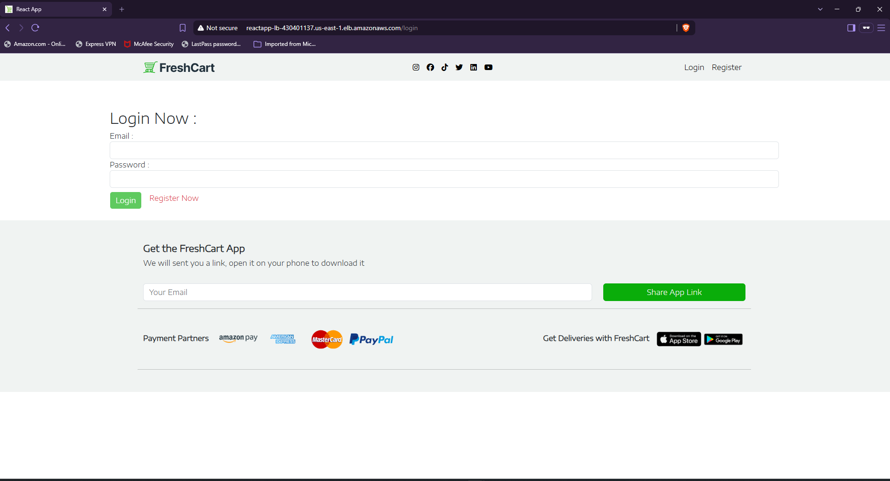
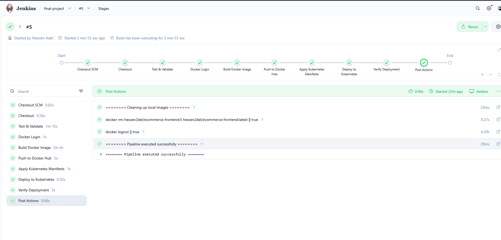
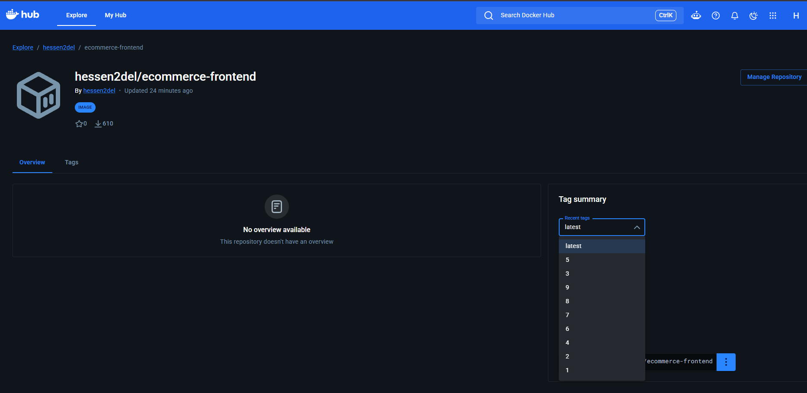
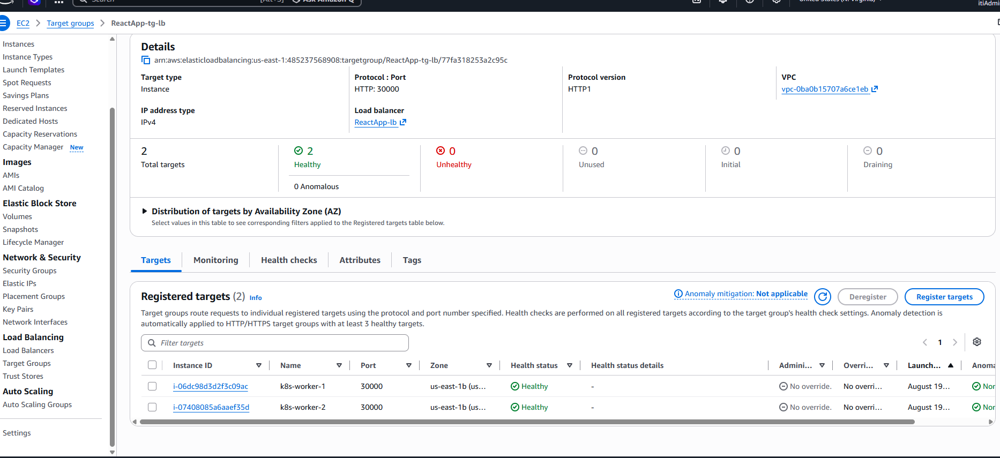
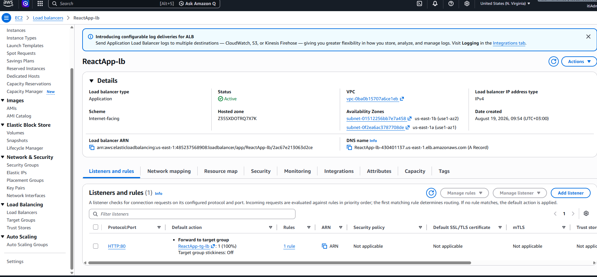
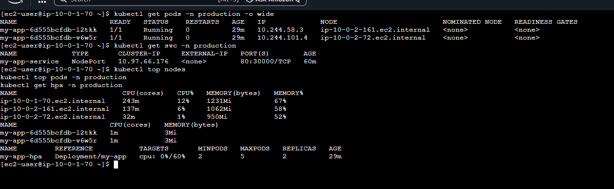

# 🛒 E-Commerce DevOps Project

## 📌 Project Overview

This project demonstrates a complete DevOps workflow for deploying a
React E-Commerce application on AWS using Infrastructure as Code,
Configuration Management, CI/CD, Containerization, and Kubernetes.

The infrastructure and deployment process are fully automated using
Terraform, Ansible, Jenkins, Docker, and Kubernetes.

---

## 🏗️ Architecture

```text
                         GitHub
                            │
                            ▼
                         Jenkins
                            │
              ┌─────────────┴─────────────┐
              │                           │
          Test & Build              Docker Build
              │                           │
              │                           ▼
              │                      Docker Hub
              │                           │
              └──────────────┬────────────┘
                             │
                             ▼
                      Kubernetes Cluster
                             │
                    ┌────────┴────────┐
                    │                 │
                Master Node       Worker Nodes
                                      │
                              ┌───────┴───────┐
                              │               │
                           my-app           my-app
                            Pod               Pod
                              │               │
                              └───────┬───────┘
                                      │
                                Kubernetes
                                  Service
                                NodePort 30000
                                      │
                                      ▼
                              AWS Target Group
                                      │
                                      ▼
                                AWS ALB
                                      │
                                      ▼
                                  End User
```
🛠️ Technologies Used
Technology	Purpose
GitHub	Source Code Management
Jenkins	CI/CD Automation
Docker	Containerization
Docker Hub	Container Registry
Kubernetes	Container Orchestration
Terraform	Infrastructure as Code
Ansible	Configuration Management
AWS EC2	Compute Infrastructure
AWS ALB	Load Balancing
AWS Target Group	Traffic Routing
Calico	Kubernetes Networking
Metrics Server	Resource Metrics
HPA	Automatic Scaling
☁️ AWS Infrastructure


The infrastructure is provisioned using Terraform.

Main Components
VPC
Public/Private Subnets
Internet Gateway
Route Tables
EC2 Instances
Security Groups
Application Load Balancer
Target Group
Kubernetes Infrastructure
1 Control Plane Node
2 Worker Nodes
Calico CNI
Metrics Server
Kubernetes Service
Horizontal Pod Autoscaler
🔄 CI/CD Pipeline

The Jenkins pipeline performs the following steps:

Checkout source code from GitHub
Install dependencies
Run tests
Build React application
Build Docker image
Login to Docker Hub
Push Docker image
Apply Kubernetes manifests
Update Kubernetes Deployment
Verify rollout status
Git Push
   ↓
Jenkins
   ↓
Test
   ↓
Build
   ↓
Docker Image
   ↓
Docker Hub
   ↓
Kubernetes
   ↓
Deployment
   ↓
Application
🐳 Docker


The application is containerized using Docker.

Docker image:

hessen2del/ecommerce-frontend

Images are tagged using the Jenkins build number:

hessen2del/ecommerce-frontend:<BUILD_NUMBER>

and:

hessen2del/ecommerce-frontend:latest
☸️ Kubernetes

The application is deployed inside the production namespace.

Deployment
Deployment: my-app
Replicas: 2
Service
Service: my-app-service
Type: NodePort
Port: 80
NodePort: 30000
High Availability

The application runs on two worker nodes:

Worker 1 → my-app Pod
Worker 2 → my-app Pod
📈 Autoscaling

Horizontal Pod Autoscaler is configured based on CPU utilization.

Minimum Replicas: 2
Maximum Replicas: 5
Target CPU: 60%

Metrics Server provides CPU and memory metrics to Kubernetes.

Example:

CPU: 1% / 60%
Replicas: 2
🌐 Load Balancing

The application is exposed through an AWS Application Load Balancer.

Internet
   ↓
AWS ALB
   ↓
Target Group
   ↓
Kubernetes Nodes :30000
   ↓
Kubernetes Service
   ↓
Application Pods

Target Group health checks ensure that traffic is sent only to healthy Kubernetes nodes.


⚙️ Configuration Management

Ansible is used to configure the Jenkins server automatically.

The Jenkins server is configured with:

Java 21
Jenkins
Docker
kubectl
Ansible
Git
Required utilities

Jenkins is also configured with access to the Kubernetes cluster.

🔐 Security

Security considerations include:

AWS Security Groups
Kubernetes RBAC
Jenkins Kubernetes ServiceAccount
Docker Hub credentials stored in Jenkins Credentials
Kubernetes kubeconfig managed for Jenkins
Restricted NodePort access


🚀 Deployment
1. Provision Infrastructure
terraform init
terraform plan
terraform apply
2. Configure Servers
ansible-playbook playbooks/jenkins.yml
3. Deploy Application

Jenkins automatically executes the CI/CD pipeline after the source code changes.

🧹 Cleanup

To destroy the AWS infrastructure:

terraform plan -destroy
terraform destroy
👨‍💻 Project Goals

This project demonstrates practical experience with:

Infrastructure as Code
Configuration Management
CI/CD
Docker
Kubernetes
AWS
Load Balancing
Kubernetes RBAC
Autoscaling
Container Registry
DevOps Automation


## Application



## CI/CD Pipeline



## Docker Hub



## AWS Target Group



## AWS Load Balancer



## Kubernetes




